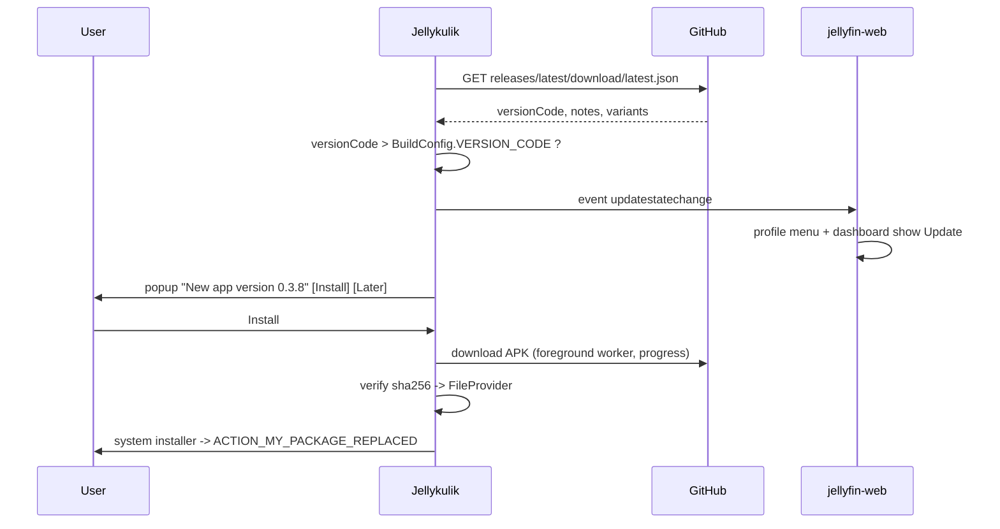

# In-app update (Jellykulik)

Design and implementation notes for updating the Android app from inside the app, without the Play Store.

## Goal

- Detect a newer app version and tell the user about it:
  - a popup right after the library screen is loaded,
  - an `Update` entry in the profile menu (above `Profile`),
  - a button in the dashboard next to `Scan all libraries`.
- The popup shows the new version (and release notes) with `Install` / `Later`.
- `Install` downloads the APK with a progress bar and then hands it to the system installer.
- `Later` suppresses the popup for 24 hours, but a *newer* release shows again immediately.

## Where releases live

Binaries stay on GitHub Releases of the fork. A generated `latest.json` sits next to them, so the app
has a single stable URL that always points at the newest release:

```
https://github.com/michalkulik/jellyfin-android/releases/latest/download/latest.json
```

| Thing | Location |
| --- | --- |
| APK binaries | GitHub Releases, `jellyfin-android-v<ver>-<flavor>-release.apk` (signed with the fork key) |
| Version manifest | `latest.json`, an extra asset of the same release |
| Downloaded APK on device | `filesDir/updates/` (app-private, no storage permission) |
| Install | `FileProvider` -> system package installer |

Why a manifest instead of the Releases REST API:

- `api.github.com` allows only 60 requests/hour per IP (CGNAT shares the quota), while
  `releases/latest/download/...` is a plain redirect to a CDN without a quota.
- The manifest carries `size` and `sha256`, needed to verify the download before installing.
- It decorates *how* the app learns about versions; moving the binaries elsewhere is a one-line change.
- Traffic goes to GitHub, not to `jellyfin.mkulik.eu`, so the fail2ban-protected reverse proxy is not
  involved and the check works even while the server is unreachable.

### Manifest contract

```json
{
  "version": "0.3.8",
  "versionCode": 30899,
  "publishedAt": "2026-09-21T10:00:00Z",
  "notes": "Fixes for playback and the slow connection screen.",
  "variants": {
    "libre":       { "url": "https://.../jellyfin-android-v0.3.8-libre-release.apk",
                     "size": 28570812, "sha256": "..." },
    "proprietary": { "url": "https://.../jellyfin-android-v0.3.8-proprietary-release.apk",
                     "size": 29551616, "sha256": "..." }
  }
}
```

The variant is picked with `BuildConfig.IS_PROPRIETARY`. `versionCode` uses the same formula as
`buildSrc/src/main/kotlin/VersionUtils.kt` (`MA*1000000 + MI*10000 + PA*100 + 99`).

## Flow



## Native layer (jellyfin-android)

| File | Role |
| --- | --- |
| `update/UpdateManifest.kt` | `latest.json` models, version code parsing |
| `update/UpdateClient.kt` | fetches and parses the manifest (plain OkHttp, like `DownloadJobClient`) |
| `update/UpdateState.kt` | state machine (unknown/checking/uptodate/available/downloading/downloaded/failed) |
| `update/UpdateStateJson.kt` | serializes the state for the web client |
| `update/UpdateManager.kt` | Koin singleton, `StateFlow<UpdateState>`, check throttle, snooze, install |
| `update/UpdateDownloadWorker.kt` | foreground `CoroutineWorker`, progress notification, sha256 check |
| `update/UpdateNotificationManager.kt` | progress notification on its own channel |
| `update/UpdateInstaller.kt` | unknown-sources permission + install intent via `FileProvider` |
| `update/UpdatePackageReplacedReceiver.kt` | removes the package after a successful update |
| `update/UpdateDialogFragment.kt` + `res/layout/dialog_update.xml` | the prompt, its progress bar and buttons |
| `bridge/NativeInterface.kt` | `getUpdateState()`, `openUpdateDialog()` |
| `events/ActivityEvent.kt` | `RequestUpdateDialog` |
| `assets/native/nativeshell.js` | `updatecheck` feature, `window.NativeShell.*` update methods |
| `JellyfinApplication.kt` | fire-and-forget check on start, cleanup of old packages |
| `AndroidManifest.xml` | `REQUEST_INSTALL_PACKAGES`, `FileProvider`, installer `<queries>` |
| `tools/make-test-manifest.py` | builds a `latest.json` for local testing |
| `tools/test-version-code.sh` | checks the workflow's version code formula against `VersionUtils.kt` |

Debug builds (`org.jellyfin.mobile.debug`) have a different package and key, so a release APK cannot be
installed over them. The whole chain still runs in debug, including building the `FileProvider` uri;
only the installer intent is not launched and a toast explains why.

## Web layer (jellyfin-web fork)

| File | Change |
| --- | --- |
| `src/components/toolbar/AppUserMenu.tsx` | `Update` menu item above `Profile` |
| `src/constants/appFeature.ts` | `AppFeature.Update = 'updatecheck'` |
| `src/scripts/shell.js` | `openUpdateDialog()` |
| `src/scripts/updateState.js` | `getUpdateState()` + `updatestatechange` listener |
| `src/apps/dashboard/components/widgets/ServerInfoWidget.tsx` | `Update` button next to `Scan all libraries` |
| `src/apps/dashboard/routes/index.tsx` | handler for that button |
| `src/strings/*.json` | `ButtonUpdate`, `UpdateAvailable`, ... |

The app loads the web client from the server, so these need a web deploy; the native feature gate
(`appHost.supports('updatecheck')`) keeps old web builds working with a new app and vice versa.

## Snooze rules

- Checks run at app start and when the library screen appears, throttled to once per 6 hours unless forced.
- `Later` stores the version code and a timestamp. The popup returns after 24 hours, or immediately when
  a version newer than the snoozed one appears.
- "Newest version" comes from the `/releases/latest/` URL, so no release number is hardcoded in the app.

## Security

- HTTPS only, restricted to GitHub hosts.
- `sha256` verified before installing; a mismatch fails with a message and nothing is installed.
- The APK must be signed with the same key as the installed app (it is) and the same flavor is used.
- `notes` from the manifest are rendered as plain text.
- The downloaded APK is deleted after `ACTION_MY_PACKAGE_REPLACED` and on start when it is not newer.

## Testing (adb)

The updater reads its manifest URL from `pref_update_manifest_url` when set, so the flow can be
tested without publishing a release:

```powershell
# build a manifest next to a fake APK
python tools\make-test-manifest.py <dir> 9.9.9 99999 http://127.0.0.1:8123 proprietary

# serve it and expose it to the device
python -m http.server 8123 --bind 0.0.0.0 --directory <dir>
adb reverse tcp:8123 tcp:8123
# then set pref_update_manifest_url to http://127.0.0.1:8123/latest.json
```

Debug builds accept http URLs and any host, release builds only https on GitHub.

Verified on a Galaxy A32 (Android 13) with the debug build:

1. Prompt appears once the webapp is loaded, showing version, notes, `Install` and `Later`.
2. `Install` downloads with a progress bar and percentage, plus a foreground notification.
3. The stored file matches the manifest `size` and `sha256` (`run-as` + `sha256sum`).
4. A wrong `sha256` fails with "Checksum mismatch", installs nothing and leaves no partial file.
5. `Cancel` during the download stops the worker and returns to the `Install`/`Later` state.
6. The `FileProvider` uri is built correctly
   (`content://org.jellyfin.mobile.debug.updates/updates/...`); in a release build it is handed to the
   system installer after the user allows installing unknown apps.
7. `Later` stores a 24 hour snooze, and a newer version shows the prompt again right away.
8. The start up check is not throttled away by an earlier run (the forced-check timestamp is per process).

